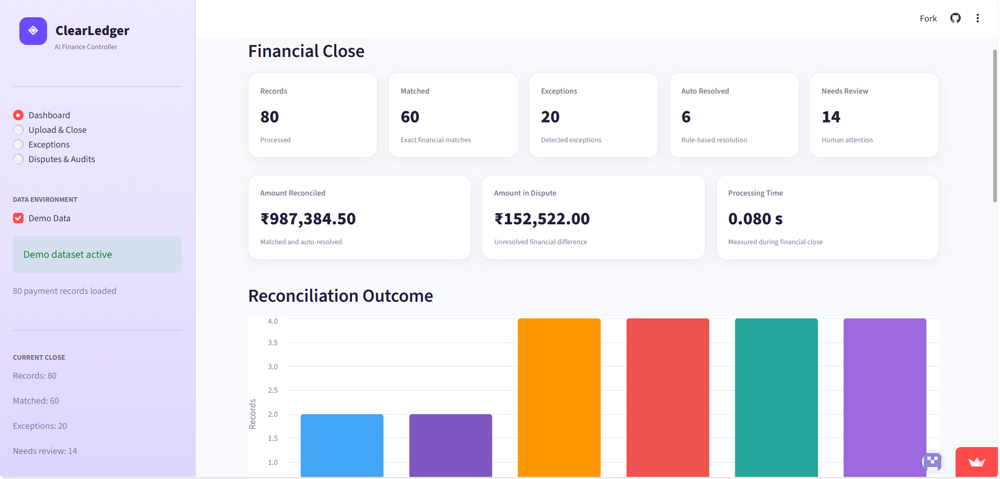
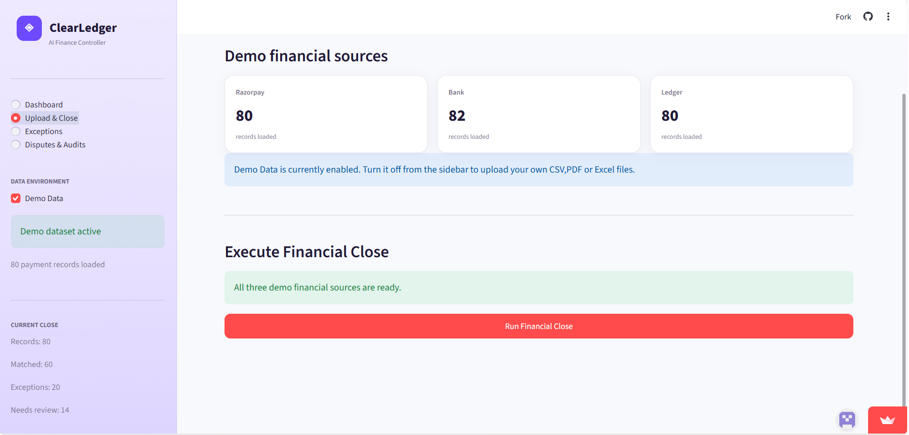
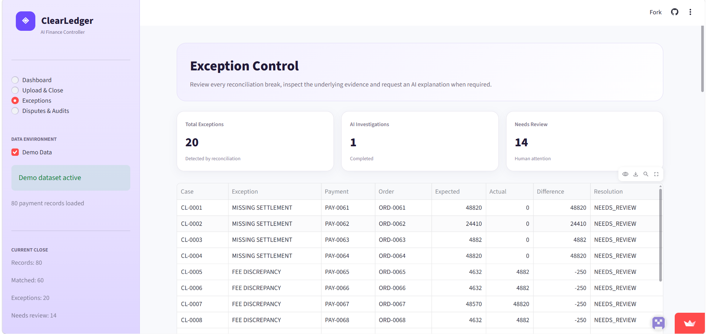

# ClearLedger — AI Finance Controller

**Intelligent Reconciliation, Exception Detection & Dispute Automation**

ClearLedger is an AI-assisted financial reconciliation and audit platform designed to help finance teams reconcile payment settlements, bank statements, and internal ledger records.

Instead of manually comparing hundreds of transactions, ClearLedger establishes a **deterministic financial truth**, identifies discrepancies, investigates exceptions using AI, builds supporting evidence, and generates a ready-to-review dispute draft.

> **Financial truth first. AI where reasoning is valuable. Human approval before action.**

---

## 🚀 Live Demo

**Streamlit App:**
https://clearledger-8gmsin4wscgjfqyidm5kfd.streamlit.app/

**GitHub Repository:**
https://github.com/harshiniuppucherla/ClearLedger

---

## 🎯 Razorpay AI Buildathon

**Track 04 — AI Finance Controller**

ClearLedger is designed around the AI Finance Controller use case: reducing manual finance operations while keeping financial calculations deterministic and human-controlled.

The workflow closes the finance-operations loop:

```text
Ingest
  ↓
Validate
  ↓
Reconcile
  ↓
Detect
  ↓
Investigate
  ↓
Explain
  ↓
Evidence
  ↓
Act
  ↓
Audit
```

---

## 💡 The Problem

Finance teams often need to reconcile data from multiple financial systems:

* Payment-platform settlement reports
* Bank statements
* Internal merchant ledgers

These sources can contain:

* Missing transactions
* Duplicate transactions
* Fee mismatches
* Tax/GST discrepancies
* Incorrect settlement amounts
* UTR mismatches
* Rounding differences
* Chargeback/dispute-related discrepancies
* Unmatched bank transactions

Traditional reconciliation can identify that **something doesn't match**, but investigating the reason behind every mismatch can still require significant manual effort.

The harder question is:

> **"Why doesn't it match, what evidence supports the finding, and what should the finance team do next?"**

ClearLedger is designed to help answer that question.

---

## 💎 The Solution

ClearLedger transforms reconciliation into an automated finance-control workflow.

### Input

Users can upload:

1. Payment/Razorpay settlement CSV
2. Bank statement CSV
3. Merchant ledger CSV

A built-in synthetic demo dataset is also available for testing the complete workflow without using real financial information.

### Processing

ClearLedger:

1. Validates uploaded data
2. Normalizes transaction information
3. Matches transactions across financial sources
4. Calculates expected vs. actual values
5. Detects discrepancies
6. Classifies exceptions
7. Investigates difficult exceptions using AI
8. Builds an evidence trail
9. Generates a dispute draft
10. Produces reconciliation and audit information

---

## ✨ Key Features

### 📊 Financial Reconciliation Dashboard

Provides an overview of:

* Total transactions processed
* Matched transactions
* Exceptions
* Unresolved records
* Discrepancy amounts
* Reconciliation status
* Exception categories

---

### 🔍 Automatic Exception Detection

The deterministic reconciliation layer identifies scenarios such as:

* Amount discrepancies
* Fee discrepancies
* Tax discrepancies
* Missing transactions
* Duplicate transactions
* UTR mismatches
* Unmatched records

---

### 🤖 AI-Assisted Investigation

AI is used after deterministic reconciliation to investigate difficult exceptions.

It can help:

* Explain potential causes
* Summarize transaction evidence
* Generate human-readable explanations
* Recommend next steps
* Prepare dispute drafts

---

### 🧾 Evidence-Backed Investigation

ClearLedger attempts to provide the context behind an exception rather than simply displaying a mismatch amount.

For example:

```text
Transaction: PAY_1023

Expected Settlement: ₹10,000
Actual Bank Credit:   ₹9,970

Difference:            ₹30

Status: Fee Discrepancy

Evidence:
✓ Payment record
✓ Order information
✓ Settlement information
✓ Bank transaction
✓ Merchant ledger record

AI Investigation:
Potential excess deduction of ₹30 based on the
difference between expected settlement and
observed bank credit.

Recommended Action:
Review evidence and prepare a dispute if confirmed.
```

The objective is:

```text
Mismatch
   ↓
Explanation
   ↓
Evidence
   ↓
Recommended Action
   ↓
Human Review
```

---

### 📝 Dispute Draft Generation

For eligible exceptions, ClearLedger can generate a human-readable dispute draft based on the reconciliation evidence.

The draft is intended for **review and approval by the finance team**.

ClearLedger does not automatically submit financial disputes.

---

### 🧾 Financial Close & Audit Information

ClearLedger supports financial close workflows by providing reconciliation results, exception information, and supporting evidence that can be reviewed as part of a finance-control process.

---

## 🏗️ Architecture

```text
┌─────────────────────┐
│ Payment / Razorpay  │
│ Settlement CSV      │
└──────────┬──────────┘
           │
┌──────────▼──────────┐
│ Bank Statement CSV  │
└──────────┬──────────┘
           │
┌──────────▼──────────┐
│ Merchant Ledger CSV │
└──────────┬──────────┘
           │
           ▼
┌─────────────────────────┐
│ Data Validation &       │
│ Normalization           │
└────────────┬────────────┘
             │
             ▼
┌─────────────────────────┐
│ Deterministic           │
│ Reconciliation Engine   │
└────────────┬────────────┘
             │
             ▼
┌─────────────────────────┐
│ Financial Truth Engine  │
│ Expected vs Actual      │
└────────────┬────────────┘
             │
             ▼
┌─────────────────────────┐
│ Exception Detector      │
└────────────┬────────────┘
             │
       ┌─────┴─────┐
       ▼           ▼
   Matched      Exceptions
                   │
                   ▼
          ┌─────────────────┐
          │ AI Investigator │
          └────────┬────────┘
                   │
                   ▼
          ┌─────────────────┐
          │ Evidence Builder│
          └────────┬────────┘
                   │
                   ▼
          ┌─────────────────┐
          │ Dispute Draft   │
          └────────┬────────┘
                   │
                   ▼
          ┌─────────────────┐
          │ Human Review    │
          └────────┬────────┘
                   │
                   ▼
          ┌─────────────────┐
          │ Audit Information│
          └─────────────────┘
```

---

## 🧠 Why AI Is Used Carefully

ClearLedger does **not** rely on an LLM to determine the core financial truth.

The system separates deterministic financial processing from AI-assisted reasoning.

### Deterministic Layer

Python/Pandas handles:

* Data validation
* Transaction normalization
* Transaction matching
* Amount calculations
* Fee/tax calculations
* Difference calculations
* Duplicate detection
* UTR comparison
* Exception classification
* Reconciliation status

### AI Layer

AI is used where reasoning and language generation are more valuable:

* Exception investigation
* Possible discrepancy explanations
* Evidence summarization
* Human-readable financial explanations
* Dispute draft generation

### Human Layer

The finance user remains responsible for the final financial decision.

```text
Python / Pandas
       ↓
Financial Truth
       ↓
Exception Detection
       ↓
AI Investigation
       ↓
Evidence
       ↓
Human Approval
       ↓
Action
```

This architecture reduces the risk of allowing an LLM to directly determine financial calculations.

---

## 🔄 End-to-End Workflow

```text
Financial Data
      ↓
Upload / Demo Dataset
      ↓
Data Validation
      ↓
Normalization
      ↓
Reconciliation
      ↓
Expected vs Actual
      ↓
Exception Detection
      ↓
AI Investigation
      ↓
Evidence Generation
      ↓
Dispute Draft
      ↓
Human Review
      ↓
Financial Close / Audit
```

---

## ## 🧪 Demo Dataset

ClearLedger includes a **synthetic 80-record demo dataset** so the complete reconciliation workflow can be demonstrated without requiring real merchant financial information.

The demo dataset is intentionally designed with:

* **60 fully matched records**
* **20 records containing different exception scenarios**

The exception scenarios include:

* Missing settlements
* Fee discrepancies
* GST discrepancies
* Rounding differences
* Chargeback adjustments
* Ledger mismatches

> **All demo transactions are synthetic and are not real customer or merchant financial data.**

---

## 📈 Batch Reconciliation Testing

ClearLedger is designed to process reconciliation batches rather than a single transaction.

### Benchmark

| Metric            |                              Result |
| ----------------- | ----------------------------------: |
| Records processed |                              **80** |
| Matched           |                              **60** |
| Exception records |                              **20** |
| Processing time   | **Dynamic / application dependent** |

The demo dataset is structured as:

```text
Total Records:       80
Matched Records:     60
Exception Records:   20

Match Rate:          75%
Exception Rate:      25%
```

### Demo Data Distribution

 | Scenario              |  Count |
 | --------------------- | -----: |
 | Matched               | **60** |
 | Missing Settlement    |  **4** |
 | Fee Discrepancy       |  **4** |
 | GST Discrepancy       |  **4** |
 | Rounding Difference   |  **4** |
 | Chargeback Adjustment |  **2** |
 | Ledger Mismatch       |  **2** |
 | Total                 | **80** |

### Exception Breakdown

| Exception Type        |  Count |
| --------------------- | -----: |
| Fee discrepancy       |  **4** |
| GST discrepancy       |  **4** |
| Missing settlement    |  **4** |
| Rounding difference   |  **4** |
| Chargeback adjustment |  **2** |
| Ledger mismatch       |  **2** |
| **Total exceptions**  | **20** |

The demo also includes deliberately modified financial values to test the reconciliation engine:

* Missing settlements have the corresponding bank credit set to **₹0.00**
* Fee discrepancy records have the fee increased by **₹250**
* GST discrepancy records have GST increased by **₹45**
* Rounding-difference records have bank credit increased by **₹0.01**
* Chargeback records have bank credit reduced by **₹1,000**
* Ledger-mismatch records have the ledger invoice amount reduced by **₹500**

The reconciliation engine calculates these results dynamically from the underlying records rather than relying on hard-coded dashboard values.

> **Metrics such as processing time, auto-resolved records, unresolved records, straight-through rate, and amount reconciled should be taken from the actual application run. ClearLedger intentionally surfaces unresolved exceptions instead of forcing every transaction into a match.**

## 📂 Flexible CSV Processing

Real-world financial CSV files are rarely perfectly standardized.

ClearLedger uses a normalization layer to convert uploaded data into a canonical internal transaction structure.

Conceptually:

```text
Raw Financial Data
       ↓
Validation
       ↓
Normalization
       ↓
Canonical Transaction Structure
       ↓
Reconciliation Engine
```

This separates raw uploaded data from the internal reconciliation logic.

Additional columns and different column ordering can be handled where the required financial fields can be identified by the application's supported schema.

---

## 🛠️ Technology Stack

| Technology | Purpose                                          |
| ---------- | ------------------------------------------------ |
| Python     | Core application logic                           |
| Streamlit  | Web application and dashboard                    |
| Pandas     | Financial data processing                        |
| NumPy      | Numerical operations                             |
| Altair     | Data visualization                               |
| OpenPyXL   | Spreadsheet processing                           |
| Groq API   | AI-assisted investigation and dispute generation |
| CSV        | Financial data ingestion                         |

---

## 📁 Project Structure

```text
ClearLedger/
│
├── app.py
├── reconciliation.py
├── ai_controller.py
├── requirements.txt
├── README.md
└── .gitignore
```

### `app.py`

Contains the Streamlit application, user interface, file uploads, dashboard, and workflow orchestration.

### `reconciliation.py`

Contains the deterministic financial processing layer, including:

* Validation
* Normalization
* Matching
* Discrepancy detection
* Exception classification
* Reconciliation processing
* Audit information generation
* Demo financial data

### `ai_controller.py`

Contains AI-assisted functionality for:

* Exception investigation
* Evidence interpretation
* Financial explanations
* Dispute draft generation

---

## ⚙️ How to Run Locally

### 1. Clone the repository

```bash
git clone https://github.com/harshiniuppucherla/ClearLedger.git
cd ClearLedger
```

### 2. Create a virtual environment

```bash
python -m venv venv
```

### 3. Activate the virtual environment

**Windows:**

```bash
venv\Scripts\activate
```

**macOS / Linux:**

```bash
source venv/bin/activate
```

### 4. Install dependencies

```bash
pip install -r requirements.txt
```

### 5. Configure the Groq API key

Configure the API key using the method expected by the application/deployment environment.

For local development, use an environment file or another secure secret-management approach supported by the application.

**Never commit a real API key to GitHub.**

### 6. Run Streamlit

```bash
streamlit run app.py
```

The application should open in your browser.

---

## ☁️ Deployment

ClearLedger can be deployed using **Streamlit Community Cloud** or another suitable hosting environment.

The main application entry point is:

```text
app.py
```

For deployment, API keys and other sensitive configuration should be stored using the platform's secret-management functionality rather than committed to the repository.

---

## 🔐 Security & Data Handling

ClearLedger is currently an **MVP/prototype** and should not be treated as a production financial system.

For demonstrations, synthetic data should be used.

A production deployment would require additional controls, including:

* Authentication
* Authorization
* Encryption
* Secure secret management
* Persistent audit logging
* Data retention policies
* PII protection
* Access controls
* Financial compliance controls
* Secure integration with payment and banking systems

Users should avoid uploading sensitive production financial information to an unapproved deployment.

---

## ⚠️ Current Limitations

ClearLedger is an MVP and requires additional engineering before production use.

Current limitations include:

* More robust schema inference for arbitrary financial CSV formats
* Production-grade authentication and authorization
* Stronger matching for complex settlement structures
* Live payment gateway integrations
* Live banking integrations
* More comprehensive chargeback workflows
* Advanced confidence scoring
* Persistent audit storage
* Enterprise security and compliance
* Larger-scale performance testing

The system intentionally surfaces uncertain cases instead of pretending that every financial record can be automatically reconciled.

---

## 🚀 Future Roadmap

### Phase 1 — MVP

* CSV ingestion
* Multi-source reconciliation
* Exception detection
* AI investigation
* Evidence-backed dispute drafts
* Audit information

### Phase 2 — Intelligent Finance Operations

* Automatic schema mapping
* Better confidence scoring
* Historical anomaly detection
* Recurring reconciliation
* Exception prioritization
* Finance-team workflow management

### Phase 3 — Production Finance Controller

* Payment gateway integrations
* Bank integrations
* Accounting-system integrations
* Automated reconciliation schedules
* Role-based access control
* Enterprise audit infrastructure

---

## 🎯 Product Philosophy

ClearLedger follows three core principles.

### 1. Financial Truth Should Be Deterministic

Financial calculations and reconciliation decisions should not depend on an LLM's opinion.

### 2. AI Should Investigate, Not Blindly Calculate

AI is most valuable when interpreting complex exceptions, summarizing evidence, and converting financial findings into actionable explanations.

### 3. Humans Should Control Financial Actions

AI can prepare the investigation and dispute draft, but the finance user remains responsible for reviewing and approving the final action.

---

## 🏆 Why ClearLedger?

Traditional reconciliation primarily answers:

> **"What doesn't match?"**

ClearLedger aims to go further:

> **"What doesn't match, why doesn't it match, what evidence supports the finding, and what should the finance team do next?"**

```text
Reconcile
    ↓
Detect
    ↓
Investigate
    ↓
Explain
    ↓
Evidence
    ↓
Act
    ↓
Audit
```

The goal is not simply to automate reconciliation.

The goal is to turn financial exceptions into **explainable, evidence-backed, human-reviewable actions**.

---

## 👩‍💻 Author

**Harshini Uppucherla**

Built for the **Razorpay AI Buildathon — Track 04: AI Finance Controller**.

---

## ⚖️ Disclaimer

ClearLedger is an experimental AI-assisted finance-operations MVP created for demonstration and buildathon purposes.

It is not financial, accounting, legal, or compliance advice and should not be used as a production financial-control system without appropriate validation, security controls, human oversight, and compliance review.

## Dashboard



## Upload & Close



## Exceptions



## AI Investigation


## Dispute and Audit


